<div align="center">

# ⚔️ SC2002 Combat Arena

### *A turn-based RPG forged in the terminal — built on clean OO design, swappable strategies, and a deeply unhealthy respect for SOLID.*

[](https://openjdk.org/)
[](https://maven.apache.org/)
[](https://github.com/mabe02/lanterna)
[]()
[]()

<br/>

```
╔══════════════════════════════════════════════════════════════╗
║   WARRIOR    vs                GOBLIN · WOLF                 ║
║   ──────           ─────────────────────────────────────     ║
║   HP 260           Use your wits. Use your items.            ║
║   ATK  40          One wrong move and the run is over.       ║
║   DEF  20                                                    ║
║   SPD  30                    [ PRESS ENTER ]                 ║
╚══════════════════════════════════════════════════════════════╝
```

**[📄 Report](docs/SC2002_Combat_Arena_Report.pdf)** · **[🎥 Demo Video](https://youtu.be/26Em07r7CUo)** · **[📊 UML Diagrams](#-uml-diagrams)** · **[🚀 Quick Start](#-quick-start)**

</div>

---

## 🎮 What is this?

A fully-featured turn-based combat RPG that runs in your terminal. Fight waves of enemies as a Warrior or Wizard across three difficulty tiers, manage cooldowns and consumables, and chain status effects to turn the tide of battle. Under the hood, it's a carefully layered object-oriented system designed around the five SOLID principles — every feature you see in the game exists *because* an interface somewhere made it easy to add.

> **Built for NTU SC2002 — Object-Oriented Design & Programming.**
> Terminal-first. No GUI shortcuts. Everything rendered with ASCII art via [Lanterna](https://github.com/mabe02/lanterna).

---

## ✨ Features

<table>
<tr>
<td width="50%" valign="top">

### 🗡️ Two Playable Classes
- **Warrior** — Tank with *Shield Bash* (stuns enemies for 2 turns)
- **Wizard** — Glass cannon with *Arcane Blast* (AOE + permanent ATK buff on kills)

### 👾 Four Enemy Types
- **Goblin** — Balanced nuisance (ATK 35, SPD 25)
- **Wolf** — Fast and fragile (ATK 45, SPD 35)
- Plus AI-controlled player-class opponents in Custom Duel

### 🧪 Three Usable Items
- **Potion** — Instant +100 HP heal
- **Power Stone** — Free special skill use, ignores cooldown
- **Smoke Bomb** — 2 turns of total enemy-attack immunity

</td>
<td width="50%" valign="top">

### ⚡ QTE Timing System
Real-time timing bar during Custom Mode attacks:
- **PERFECT** (2.0× damage) 🎯
- **NORMAL** (1.0× damage)
- **EARLY** (0.5× damage)

### 🏟️ Two Game Modes
- **Standard** — Wave-based combat at Easy / Medium / Hard
- **Custom Duel** — 1-vs-1 against an AI opponent of any class

### 🎨 Rich Terminal UI
- ASCII sprites with per-action animation
- Floating damage numbers
- Status-effect icons & HP bars
- Multiple variant sprites per class

</td>
</tr>
</table>

---

## 🧩 Architecture at a Glance

Four layers. One entry point. Zero circular dependencies.

<div align="center">
  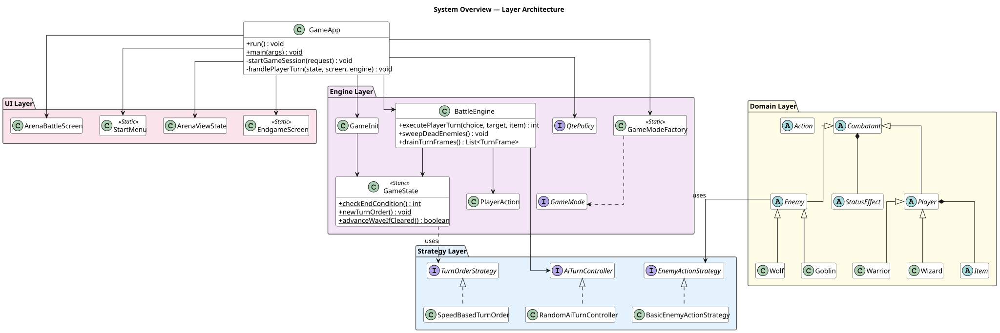
</div>

```
┌─────────────────────────────────────────────────────────────┐
│  arena.ui          →  Lanterna screens, view-state DTOs     │
│  arena.engine      →  BattleEngine, GameState, QTE, Modes   │
│  arena.strategy    →  Turn order + AI behaviour policies    │
│  arena.model       →  Combatants, Actions, Effects, Items   │
└─────────────────────────────────────────────────────────────┘
                              ▲
                              │
                        arena.GameApp
                    (top-level orchestrator)
```

**The big idea:** the UI never imports the engine. The engine never imports the UI. They meet at a single read-only DTO (`ArenaViewState`). Every variability point in the game — turn order, enemy AI, QTE behaviour, game mode — is an interface with swappable implementations. Want a new game mode? Write one class. The engine doesn't change.

---

## 🚀 Quick Start

### Prerequisites

> [!IMPORTANT]
> **JDK 26 is required.** Check with `java -version`.

- [JDK 26](https://openjdk.org/projects/jdk/26/)
- [Maven 3.9+](https://maven.apache.org/download.cgi)

### Run Precompiled Package (Recommended)
- Download latest package from Releases
- Then run it anywhere with JDK 26:
```bash
# Linux / macOS
java -jar target/sc2002-combat-arena-<version>-all.jar

# Windows (use javaw to avoid a spare console window)
javaw -jar target/sc2002-combat-arena-<version>-all.jar
```
- Introduced from `v0.3.1`, a `sc2002-combat-arena-<version>-all-compat.jar` package is available, compiled for JDK 21 and above.

### Build & Run

```bash
# Clone
git clone https://github.com/YongzhangLiu/sc2002-combat-arena.git
cd sc2002-combat-arena

# Compile & run in one go
mvn compile exec:java
```

### Package as JAR

```bash
mvn clean package
# Produces: target/sc2002-combat-arena-<version>-all.jar
```

<details>
<summary><b>🪟 Windows-specific notes (click to expand)</b></summary>

<br/>

- Lanterna falls back to `SwingTerminalFrame` on Windows — you get a window instead of a pure terminal
- Mouse clicking is not supported in the fallback renderer
- If `mvn exec:java` fails, invoke the Java binary directly:

```powershell
mvn clean compile
mvn -q compile exec:exec `
    -Dexec.executable="C:\Program Files\Java\jdk-26\bin\java.exe" `
    -Dexec.args="-cp %classpath arena.GameApp" `
    -Dexec.classpathScope=runtime
```

Replace the path with your actual JDK 26 install. Find it with `mvn -version`.

**Easiest option:** just run the packaged JAR. It bundles Lanterna and everything else.

</details>

<details>
<summary><b>🧪 Legacy UI-only profile (click to expand)</b></summary>

<br/>

Used for isolated testing of menus and screens without booting the full game loop.

```bash
mvn -Pui-only compile
mvn -Pui-only exec:java
```

</details>

---

## 🛡️ The Combatants

<table>
<tr>
<th align="center">Class</th>
<th align="center">HP</th>
<th align="center">ATK</th>
<th align="center">DEF</th>
<th align="center">SPD</th>
<th>Special Skill</th>
</tr>
<tr>
<td>⚔️ <b>Warrior</b></td>
<td align="center">260</td>
<td align="center">40</td>
<td align="center">20</td>
<td align="center">30</td>
<td><b>Shield Bash</b> — BasicAttack damage + stun target for 2 turns</td>
</tr>
<tr>
<td>🔮 <b>Wizard</b></td>
<td align="center">200</td>
<td align="center">50</td>
<td align="center">10</td>
<td align="center">20</td>
<td><b>Arcane Blast</b> — AOE damage; each kill adds +10 ATK for the rest of the level</td>
</tr>
<tr>
<td>👹 <b>Goblin</b></td>
<td align="center">55</td>
<td align="center">35</td>
<td align="center">15</td>
<td align="center">25</td>
<td><i>— BasicAttack only —</i></td>
</tr>
<tr>
<td>🐺 <b>Wolf</b></td>
<td align="center">40</td>
<td align="center">45</td>
<td align="center">5</td>
<td align="center">35</td>
<td><i>Fastest in the arena — acts before any player</i></td>
</tr>
</table>

> [!NOTE]
> Turn order is speed-based and **merges all combatants into one sorted list**. A Wolf (SPD 35) acts before the Warrior (SPD 30). The player is not guaranteed to go first — plan accordingly.

---

## 📊 UML Diagrams

All diagrams were hand-authored in PlantUML and exported to SVG. Source `.puml` files live in [`UMLDiagrams/`](UMLDiagrams/).

### System Overview

<div align="center">
  
  <br/>
  <sub><i>Four packages, one orchestrator. GameApp lives outside any layer by design.</i></sub>
</div>

<br/>

<details>
<summary><b>🗂️ Full Class Diagram — all ~63 classes</b></summary>

<br/>

<div align="center">
  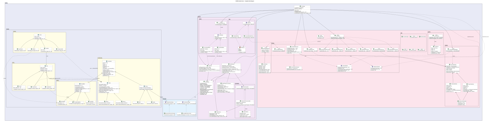
</div>

</details>

<details>
<summary><b>⚙️ Engine Layer — BattleEngine, QTE, Game Modes, AI Controller</b></summary>

<br/>

<div align="center">
  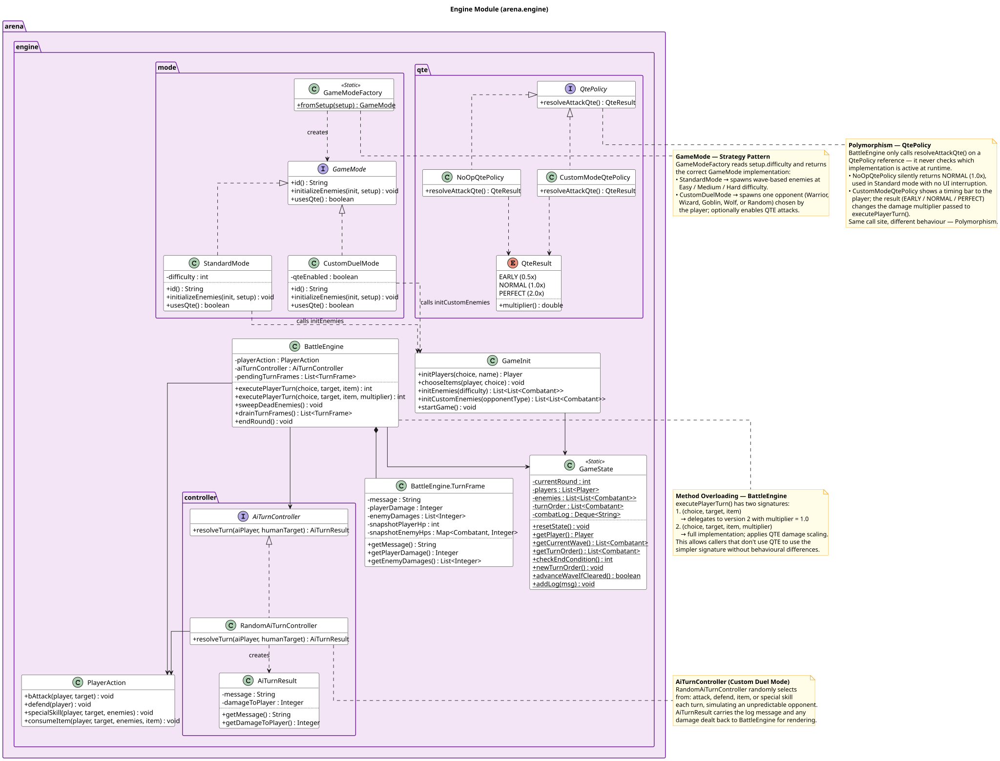
</div>

The engine coordinates a full round in a single `executePlayerTurn()` call. `QtePolicy`, `GameMode`, and `AiTurnController` are all polymorphic seams — the engine never type-checks which implementation is active.

</details>

<details>
<summary><b>🧬 Domain Layer — Combatant Hierarchy</b></summary>

<br/>

<div align="center">
  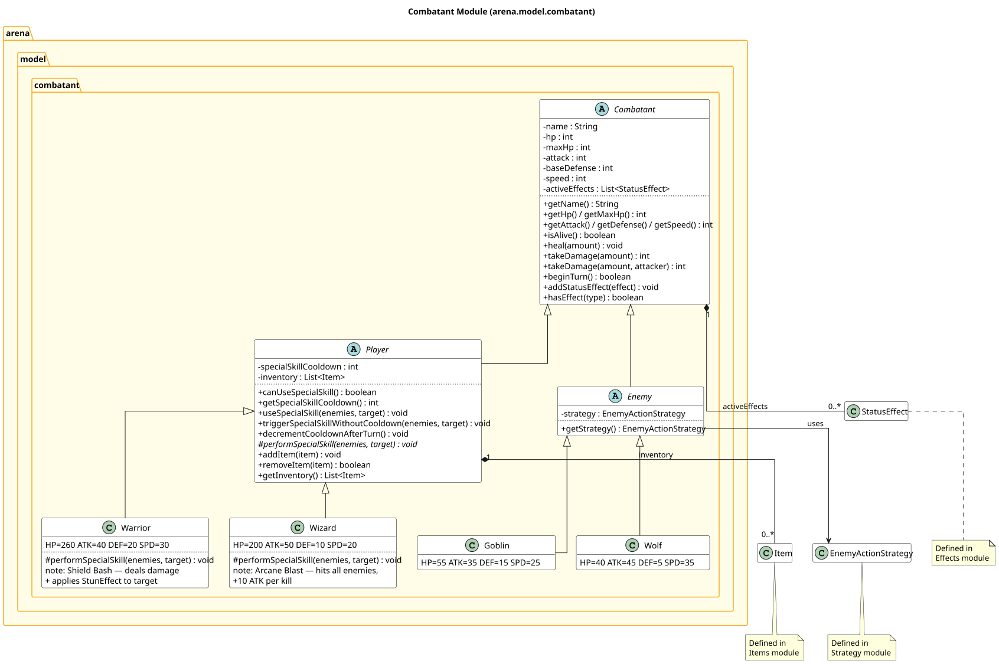
</div>

`Combatant` is the LSP-clean spine of the system. Players and enemies are interchangeable wherever a combatant is expected, which is why `SpeedBasedTurnOrder` can merge everyone into one sorted list.

</details>

<details>
<summary><b>🎭 Domain Layer — Actions, Effects, Items</b></summary>

<br/>

<div align="center">
  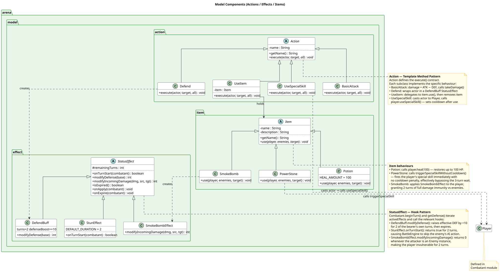
</div>

Three parallel inheritance hierarchies. `Action` uses Template Method. `StatusEffect` uses the Hook Pattern — new effects plug in by overriding `onTurnStart`, `modifyDefense`, or `modifyIncomingDamage`. `Item` implementations each define their own `use(...)` behaviour.

</details>

<details>
<summary><b>♟️ Strategy Layer — Turn Order & Enemy Behaviour</b></summary>

<br/>

<div align="center">
  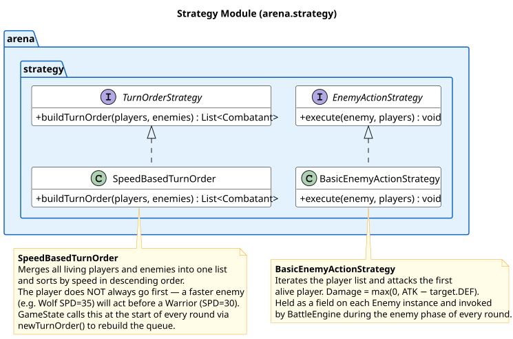
</div>

Two small interfaces. Replacing `SpeedBasedTurnOrder` with an initiative-roll strategy, or giving enemies a smarter AI, is a one-class change — the engine doesn't care.

</details>

<details>
<summary><b>🖥️ UI Layer — Screens & View State</b></summary>

<br/>

<div align="center">
  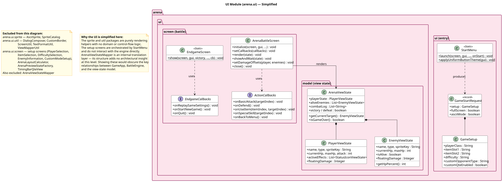
</div>

The UI only ever sees a read-only `ArenaViewState` DTO. Two focused callback interfaces (`ActionCallbacks`, `EndgameCallbacks`) keep ISP intact — neither is bloated with the other's concerns.

</details>

---

## 🎬 Sequence Walkthrough

Eight canonical scenarios trace one full Warrior-vs-Goblin encounter from first strike to victory. Each one isolates a different OOP/SOLID concept.

<details>
<summary><b>⚔️ Scenario 1 — Goblin's Basic Attack on Warrior</b></summary>

<br/>

<div align="center">
  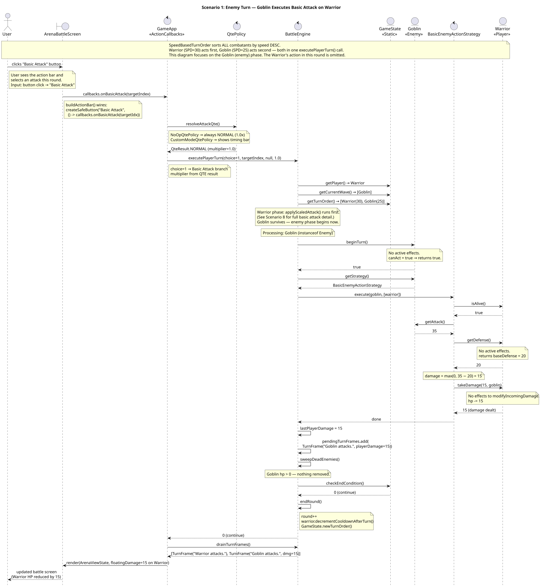
</div>

**Demonstrates:** Polymorphism + DIP — `BattleEngine` dispatches to `EnemyActionStrategy` through its interface. Damage is computed as `max(0, ATK − DEF)`.

</details>

<details>
<summary><b>🛡️ Scenario 2 — Warrior Defends</b></summary>

<br/>

<div align="center">
  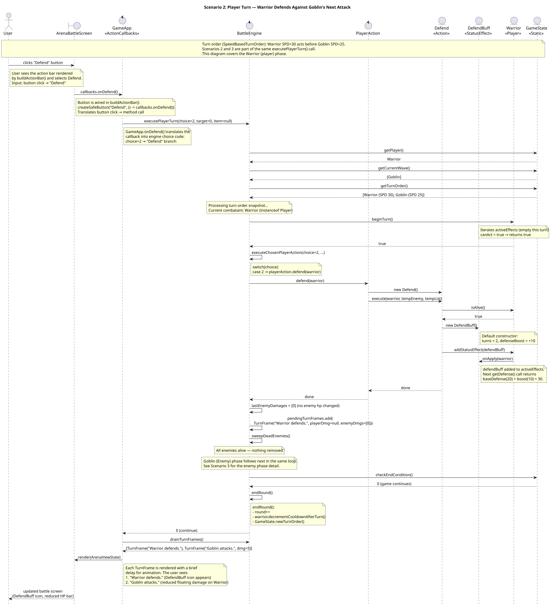
</div>

**Demonstrates:** Template Method + Composition — `Defend.execute()` adds a `DefendBuff` to the Warrior's `activeEffects` list. The action collaborates with the effect rather than mutating the Warrior directly.

</details>

<details>
<summary><b>📉 Scenario 3 — Damage Reduced by DefendBuff</b></summary>

<br/>

<div align="center">
  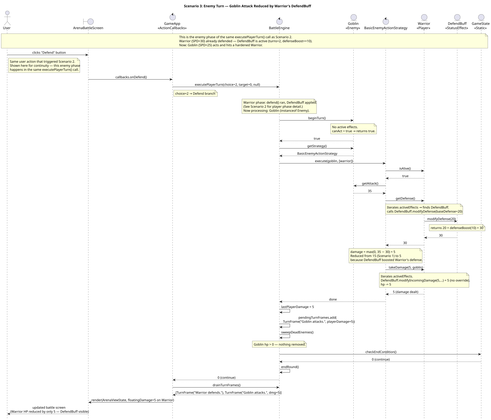
</div>

**Demonstrates:** Hook Pattern + OCP — `DefendBuff.modifyDefense(20)` returns `30` when the Warrior is queried. Damage drops from 15 to 5. No branching anywhere in the damage pipeline.

</details>

<details>
<summary><b>💥 Scenario 4 — Shield Bash Stuns Goblin</b></summary>

<br/>

<div align="center">
  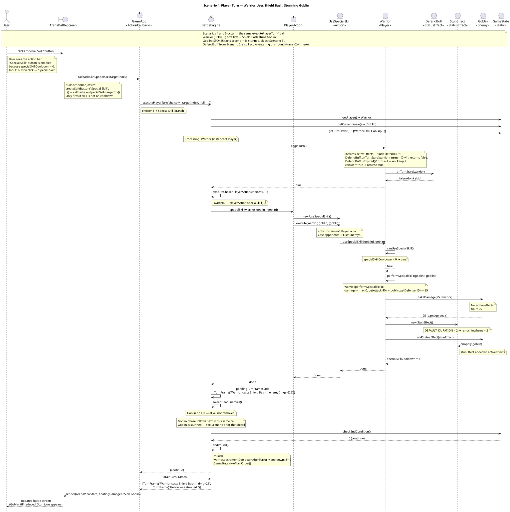
</div>

**Demonstrates:** Template Method + LSP — `Warrior.performSpecialSkill` is the subclass override; `StunEffect` substitutes cleanly as a `StatusEffect`.

</details>

<details>
<summary><b>😵 Scenario 5 — Goblin Stunned, Skips Turn</b></summary>

<br/>

<div align="center">
  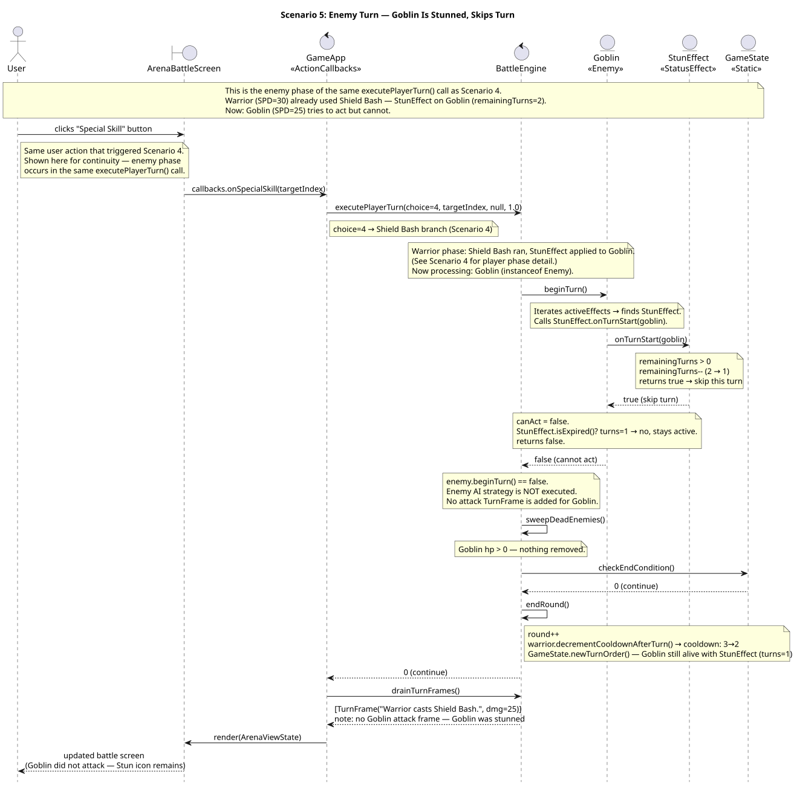
</div>

**Demonstrates:** Hook Pattern + SRP — `StunEffect.onTurnStart()` owns the "is this combatant allowed to act?" question. The engine just reads the answer.

</details>

<details>
<summary><b>🧪 Scenario 6 — Warrior Uses Potion</b></summary>

<br/>

<div align="center">
  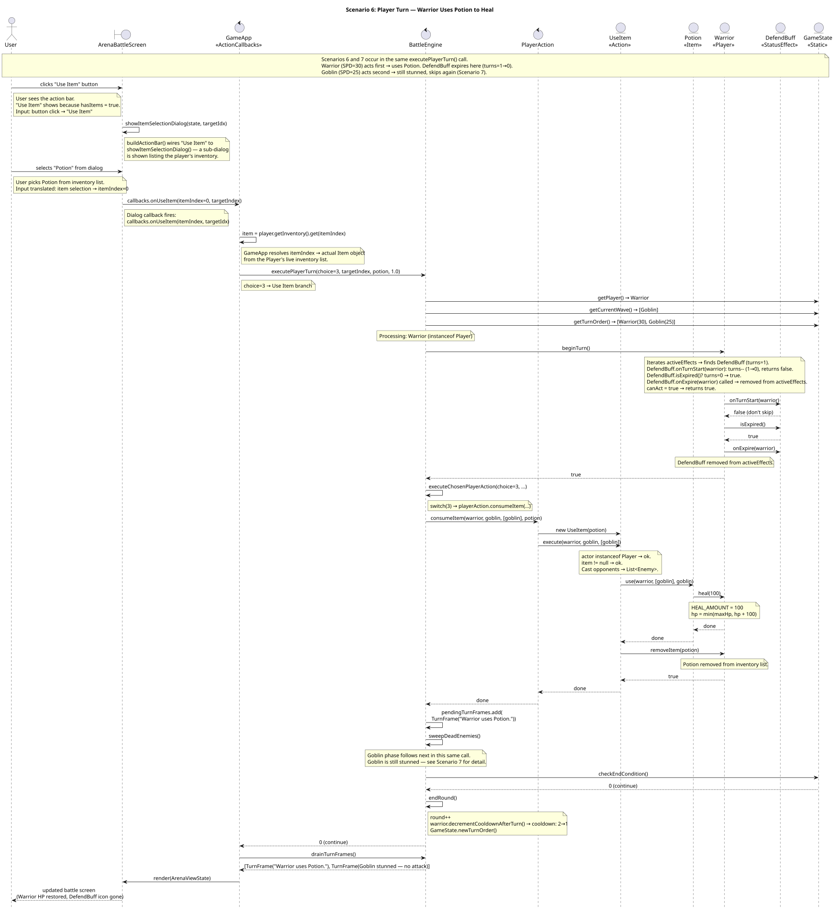
</div>

**Demonstrates:** ISP + Polymorphism — `Item.use(player, enemies, target)` is a single focused method. Items that don't need `target` (like Potion) simply ignore it.

</details>

<details>
<summary><b>⏳ Scenario 7 — StunEffect Expires</b></summary>

<br/>

<div align="center">
  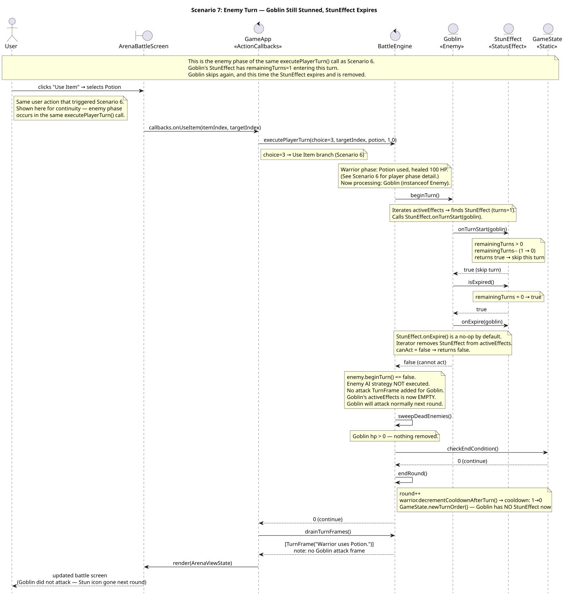
</div>

**Demonstrates:** Encapsulation — the full lifecycle of a status effect (apply → tick → expire → remove) lives inside the effect and the combatant. Nothing else needs to know.

</details>

<details>
<summary><b>🏆 Scenario 8 — Victory</b></summary>

<br/>

<div align="center">
  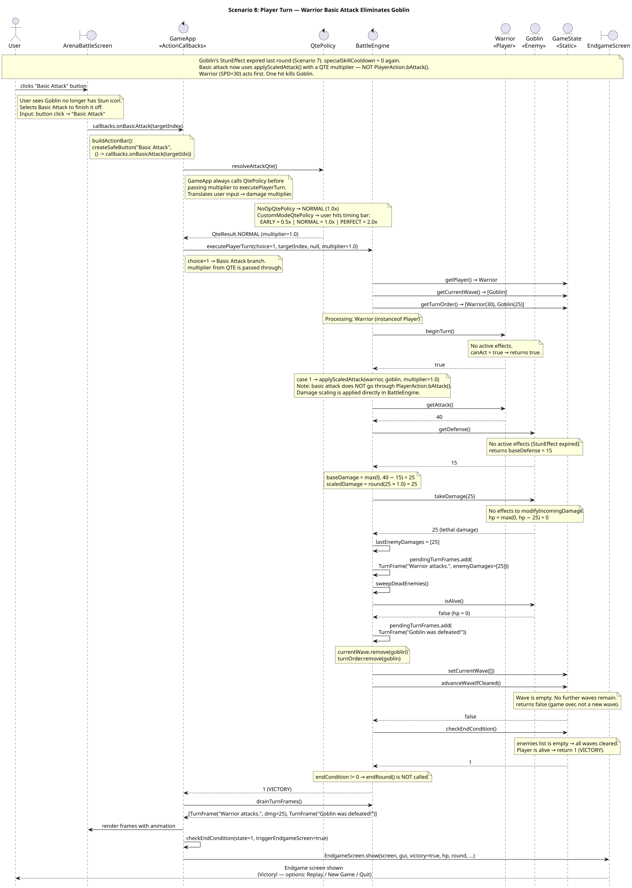
</div>

**Demonstrates:** SRP across the end-of-round chain — `applyScaledAttack` applies damage, `sweepDeadEnemies` prunes corpses, `checkEndCondition` decides the outcome, `EndgameScreen` renders it.

</details>

---

## 🧠 Design Patterns at Play

| Pattern | Where it lives | What it buys us |
|---|---|---|
| **Strategy** | `TurnOrderStrategy`, `EnemyActionStrategy`, `QtePolicy`, `GameMode`, `AiTurnController` | Every variability point is a one-class extension |
| **Template Method** | `Action.execute()`, `Player.useSpecialSkill()` | Uniform call shape with subclass-specific behaviour |
| **Hook Pattern** | `StatusEffect.onTurnStart / modifyDefense / modifyIncomingDamage` | New effects plug in without touching existing code |
| **Factory** | `GameModeFactory.fromSetup()` | Single decision point for mode selection |
| **Method Overloading** | `BattleEngine.executePlayerTurn(...)` × 2 signatures | QTE scaling added without breaking existing callers |
| **DTO / Producer-Consumer** | `ArenaViewState`, `TurnFrame` snapshots | Engine stays testable; UI stays replaceable |

---

## 📂 Project Structure

```
sc2002-combat-arena/
├── src/arena/
│   ├── GameApp.java               ← entry point, top-level orchestrator
│   ├── engine/                    ← BattleEngine, GameState, PlayerAction
│   │   ├── controller/            ← AiTurnController + implementations
│   │   ├── mode/                  ← GameMode (Standard, CustomDuel) + Factory
│   │   └── qte/                   ← QtePolicy + timing bar
│   ├── strategy/                  ← TurnOrderStrategy, EnemyActionStrategy
│   ├── model/
│   │   ├── combatant/             ← Combatant, Player, Enemy + subclasses
│   │   ├── action/                ← BasicAttack, Defend, UseItem, UseSpecialSkill
│   │   ├── effect/                ← DefendBuff, StunEffect, SmokeBombEffect
│   │   └── item/                  ← Potion, PowerStone, SmokeBomb
│   └── ui/
│       ├── screen/                ← ArenaBattleScreen, setup screens, endgame
│       ├── model/                 ← ArenaViewState DTOs
│       ├── sprite/                ← AsciiSprite, SpriteCatalog handling
│       └── util/                  ← layout, borders, formatting helpers
├── assets/sprites/                ← ASCII sprite files
├── UMLDiagrams/                   ← .puml sources + rendered .svg
├── docs/                          ← project report
└── pom.xml
```

---

## 📚 Documentation

- 📄 **[Project Report](docs/SC2002_Combat_Arena_Report.docx)** — full design write-up, OO concepts, SOLID walkthrough, test cases
- 🎥 **[Demo Video](https://youtu.be/26Em07r7CUo)** — gameplay walkthrough across all modes
- 📋 **[UML Sources](UMLDiagrams/)** — all `.puml` files + rendered SVGs

---

## 👥 Team

Built for **SC2002 — Object-Oriented Design & Programming** · NTU College of Computing and Data Science · AY25/26 Semester 2.

---

<div align="center">
  <sub>⚔️ Built with Java 26, Maven, and Lanterna · Rendered in terminals everywhere ⚔️</sub>
</div>
