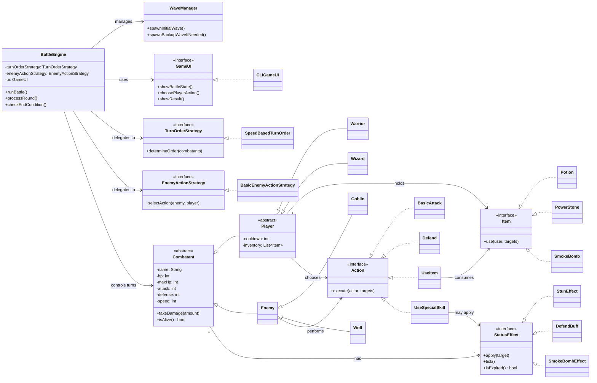

# sc2002-combat-arena
SC2002 Group Assignment: Turn-Based Combat Arena


## Build Tool

> **Maven** (`pom.xml`) used as build tool.

- Dependency management (e.g. Lanterna)
- Compilation
- Runs selected app entry points via profiles
- Output to build folder `target/`

### Build and run

- Build UI-only profile:
  - `mvn -Pui-only compile`
- Run UI-only menu app:
  - `mvn -Pui-only exec:java`
- Build default project profile:
  - `mvn compile`

### Add your own profile

> To test your own classes add another profile under `<profiles>` in `pom.xml`:

```xml
<profile>
    <id>my-feature-test</id>
    <build>
        <plugins>
            <plugin>
                <groupId>org.apache.maven.plugins</groupId>
                <artifactId>maven-compiler-plugin</artifactId>
                <version>3.11.0</version>
                <configuration>
                    <includes>
                        <include>arena/ui/MyTestApp.java</include>
                    </includes>
                </configuration>
            </plugin>
            <plugin>
                <groupId>org.codehaus.mojo</groupId>
                <artifactId>exec-maven-plugin</artifactId>
                <version>3.1.0</version>
                <configuration>
                    <mainClass>arena.ui.MyTestApp</mainClass>
                </configuration>
            </plugin>
        </plugins>
    </build>
</profile>
```

Then run:
- `mvn -Pmy-feature-test compile exec:java`

## Workflow

### Class design
- `/ui`: CLI/TUI interface (display + input)
- `/engine`: battle control and game state logic
    - round loop, turn execution, win/lose checks
    - wave/level progression and backup spawn timing
    - invokes strategies and domain actions
- `/model`: entities and related
    - combatants (player/enemy), actions, items, status effects
    - stats, cooldown state, inventory, effect durations
- `/strategy` - swappable decision policies
    - turn order strategy
    - enemy action selection strategy
    - no ownership of battle state or wave lifecycle

### Package Layout
- `arena.ui`
    - `GameUI`, `CLIGameUI`
- `arena.engine`
    - `BattleEngine`, `WaveManager`
- `arena.model.combatant`
    - `Combatant`, `Player`, `Enemy`, `Warrior`, `Wizard`, `Goblin`, `Wolf`
- `arena.model.action`
    - `Action`, `BasicAttack`, `Defend`, `UseItem`, `UseSpecialSkill`
- `arena.model.item`
    - `Item`, `Potion`, `PowerStone`, `SmokeBomb`
- `arena.model.effect`
    - `StatusEffect`, `StunEffect`, `DefendBuff`, `SmokeBombEffect`
- `arena.strategy`
    - `TurnOrderStrategy`, `SpeedBasedTurnOrder`, `EnemyActionStrategy`, `BasicEnemyActionStrategy`

```text
src/arena/
├── ui/
├── engine/
├── model/
│   ├── combatant/
│   ├── action/
│   ├── item/
│   └── effect/
└── strategy/
```


### UML diagram
- mermaid (via extension `Markdown Preview Mermaid Support`)

> [Note]
> I added a minimal UML diagram below (AI generated) for clarity. Actual logic is up for discussion.

